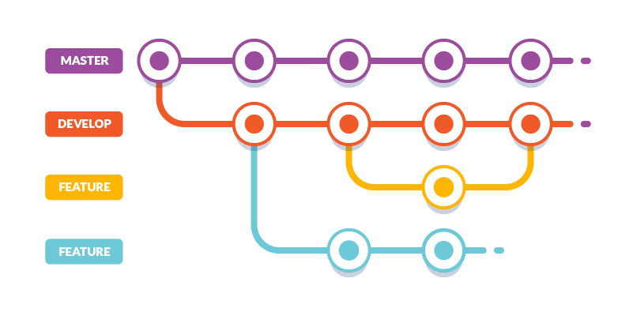
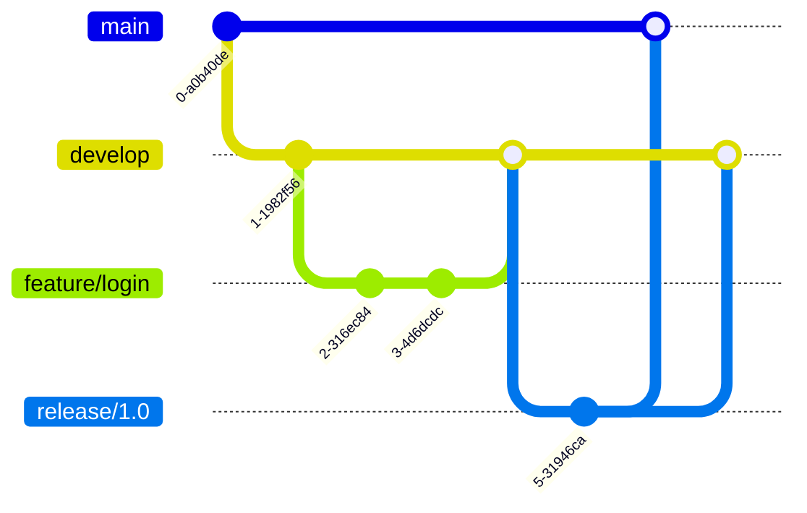

# :material-pipe: Flujo de trabajo con Git

Un buen flujo de trabajo en Git te ayudará a mantener tu proyecto organizado, colaborar eficientemente y evitar conflictos.

{ width="600" }

## :material-cog-outline: Flujo básico de trabajo

El flujo más simple en Git consta de los siguientes pasos:

1. **Modificar** archivos en tu working directory.
2. **Agregar** archivos al staging area con `git add`.
3. **Confirmar** cambios al repositorio con `git commit`.
4. **Subir** los cambios al remoto con `git push`.

### Ejemplo paso a paso

=== "Día 1: Configuración"

    ```bash
    # Clonar el repositorio
    git clone https://github.com/usuario/proyecto.git
    cd proyecto
    
    # Configurar tu identidad
    git config user.name "Tu Nombre"
    git config user.email "tu@correo.com"
    ```

=== "Día 2: Hacer cambios"

    ```bash
    # Modificar archivos
    echo "Hola Git" > saludo.txt
    
    # Verificar estado
    git status
    
    # Agregar al staging
    git add saludo.txt
    
    # Confirmar
    git commit -m "Agrega archivo de saludo"
    
    # Subir al remoto
    git push origin main
    ```

=== "Día 3: Sincronizar"

    ```bash
    # Traer cambios del remoto
    git pull origin main
    
    # Ver historial
    git log --oneline
    ```

## :material-source-branch-plus: Git Flow

**Git Flow** es uno de los modelos de ramificación más populares. Define un conjunto de ramas específicas para diferentes propósitos.

### Estructura de ramas

| Rama | Propósito | Origen | Destino |
|------|-----------|--------|---------|
| `main` | Código en producción | - | - |
| `develop` | Integración de nuevas funcionalidades | `main` | `main` |
| `feature/*` | Nuevas funcionalidades | `develop` | `develop` |
| `release/*` | Preparación de nuevas versiones | `develop` | `main` y `develop` |
| `hotfix/*` | Corrección urgente en producción | `main` | `main` y `develop` |

### Diagrama de Git Flow



## :material-github: GitHub Flow

**GitHub Flow** es un modelo más simple, ideal para proyectos con despliegue continuo.

### Pasos del GitHub Flow

1. **Crea una rama** desde `main`:
   ```bash
   git checkout -b feature/nueva-funcionalidad
   ```

2. **Realiza cambios y commits**:
   ```bash
   git add .
   git commit -m "Implementa nueva funcionalidad"
   ```

3. **Sube la rama al remoto**:
   ```bash
   git push -u origin feature/nueva-funcionalidad
   ```

4. **Abre un Pull Request** en GitHub.

5. **Revisa y discute** los cambios con tu equipo.

6. **Mergea** a `main` cuando esté aprobado.

7. **Despliega** desde `main`.

!!! tip "Recomendación"
    Para proyectos pequeños o medianos, GitHub Flow es generalmente más sencillo y efectivo que Git Flow.

## :material-alert: Resolución de conflictos

Los conflictos ocurren cuando Git no puede fusionar automáticamente los cambios. Esto sucede cuando dos personas modifican las mismas líneas de un archivo.

### Ejemplo de conflicto

Cuando hay un conflicto, verás algo así en el archivo:

```text
<<<<<<< HEAD
Esta es mi versión del cambio
=======
Esta es la versión del compañero
>>>>>>> rama-companero
```

### Cómo resolverlo

=== "Paso 1: Identificar"

    ```bash
    git status
    ```
    
    Te mostrará los archivos con conflictos.

=== "Paso 2: Editar"

    Abre el archivo y decide qué versión mantener (o combinarlas).
    Elimina los marcadores `<<<<<<<`, `=======` y `>>>>>>>`.

=== "Paso 3: Confirmar"

    ```bash
    git add archivo-conflictivo.txt
    git commit -m "Resuelve conflicto en archivo X"
    ```

??? warning "Importante"
    Nunca elimines los marcadores sin revisar el contenido. Asegúrate de entender ambas versiones antes de elegir.

## :material-file-document-multiple: Archivo .gitignore

El archivo `.gitignore` indica a Git qué archivos NO debe rastrear.

### Ejemplo de .gitignore

```text
# Archivos de sistema
.DS_Store
Thumbs.db

# Dependencias
node_modules/
__pycache__/
*.pyc

# Archivos de configuración local
.env
.env.local

# Logs
*.log
logs/

# Carpetas de build
dist/
build/
site/

# IDEs
.vscode/
.idea/
*.swp
```

!!! note "Buena práctica"
    Crea tu `.gitignore` al inicio del proyecto. Cambiarlo después puede ser complicado si ya hay archivos rastreados.

## :material-clipboard-check: Buenas prácticas

### Para commits

- :material-check: Haz commits pequeños y frecuentes.
- :material-check: Un commit = un cambio lógico.
- :material-check: Mensajes claros y en modo imperativo.
- :material-check: No incluyas archivos generados (binarios, builds).

### Para ramas

- :material-check: Usa nombres descriptivos: `feature/login`, `bugfix/header-error`.
- :material-check: Mantén las ramas cortas (pocos días).
- :material-check: Elimina las ramas después de mergear.

### Para colaboración

- :material-check: Haz `pull` antes de empezar a trabajar.
- :material-check: Comunica cambios grandes con tu equipo.
- :material-check: Revisa los Pull Requests cuidadosamente.

## :material-table: Comparación de flujos

| Característica | Git Flow | GitHub Flow | Trunk Based |
|----------------|----------|-------------|-------------|
| Complejidad | Alta | Baja | Muy baja |
| Despliegue | Por release | Continuo | Continuo |
| Ramas long-lived | Muchas | Solo `main` | Solo `main` |
| Equipo recomendado | Grande | Pequeño/Mediano | Cualquiera |
| Frecuencia de releases | Baja | Alta | Muy alta |

---

!!! success "¡Excelente progreso!"
    Ya conoces los flujos de trabajo más comunes con Git. En la siguiente sección aprenderás más sobre ramas y merges.

[:material-arrow-left: Comandos](comandos.md){ .md-button }
[Ver ramas y merges :material-arrow-right:](../avanzado/ramas.md){ .md-button .md-button--primary }
