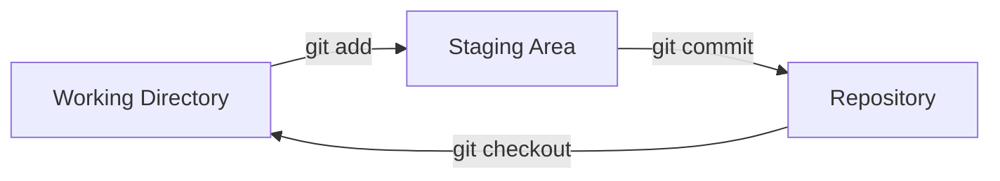

# :material-source-branch: Introducción a Git

## :material-help-circle: ¿Qué es Git?

**Git** es un sistema de control de versiones distribuido, gratuito y de código abierto, diseñado para manejar desde pequeños hasta muy grandes proyectos con velocidad y eficiencia.

Fue creado por **Linus Torvalds** en 2005 para el desarrollo del kernel de Linux y desde entonces se ha convertido en el estándar de la industria.

!!! info "Dato curioso"
    El nombre "Git" significa coloquialmente "tonto" en inglés británico. Linus Torvalds lo nombró así de manera humorística, diciendo: *"Soy un egoísta y nombré todos mis proyectos como yo. Primero Linux, ahora Git."*

## :material-clipboard-list: Características principales

| Característica | Descripción |
|----------------|-------------|
| **Distribuido** | Cada desarrollador tiene una copia completa del repositorio |
| **Velocidad** | Operaciones locales muy rápidas |
| **Integridad** | Usa SHA-1 para garantizar la integridad de los datos |
| **No-lineal** | Soporta miles de ramas paralelas |
| **Gratuito** | Software libre de código abierto |

## :material-cog: Instalación de Git

### Instalación según el sistema operativo

=== ":fontawesome-brands-windows: Windows"

    1. Descarga el instalador desde [git-scm.com/downloads](https://git-scm.com/downloads).
    2. Ejecuta el archivo `.exe`.
    3. Sigue las instrucciones del asistente.
    4. Verifica la instalación:
    
    ```powershell
    git --version
    ```

=== ":fontawesome-brands-apple: macOS"

    Usando Homebrew:
    
    ```bash
    brew install git
    git --version
    ```
    
    O descarga el instalador desde [git-scm.com](https://git-scm.com/download/mac).

=== ":fontawesome-brands-linux: Linux"

    **Ubuntu/Debian:**
    
    ```bash
    sudo apt update
    sudo apt install git
    git --version
    ```
    
    **Fedora/RHEL:**
    
    ```bash
    sudo dnf install git
    git --version
    ```

## :material-account-cog: Configuración inicial

Antes de usar Git, debes configurar tu identidad. Esta información se asociará a cada commit que hagas.

```bash
# Configura tu nombre
git config --global user.name "Tu Nombre"

# Configura tu correo electrónico
git config --global user.email "tu@correo.com"

# Verifica la configuración
git config --list
```

!!! tip "Consejo profesional"
    Usa el mismo correo electrónico que tienes registrado en GitHub para que tus commits se asocien correctamente a tu perfil.

## :material-folder-multiple: Conceptos clave

### Repositorio

Un **repositorio** (repo) es un directorio que contiene tu proyecto y un historial completo de cambios.

### Commit

Un **commit** es una "fotografía" del estado de tu proyecto en un momento determinado.

### Branch (Rama)

Una **rama** es una línea independiente de desarrollo. La rama principal suele llamarse `main` o `master`.

### Remote

Un **remoto** es una versión del repositorio alojada en un servidor (por ejemplo, GitHub).

## :material-state-machine: Los tres estados de Git

Git maneja tus archivos en tres estados:



| Estado | Descripción |
|--------|-------------|
| **Working Directory** | Archivos que estás modificando |
| **Staging Area** | Archivos preparados para el próximo commit |
| **Repository** | Cambios confirmados en el historial |

??? info "Más información sobre los estados"
    Cada archivo en Git puede estar en cuatro estados:
    
    - **Untracked**: Git no lo conoce.
    - **Modified**: Tiene cambios sin preparar.
    - **Staged**: Está preparado para el próximo commit.
    - **Committed**: Ya forma parte del historial.

## :material-arrow-right-circle: Siguientes pasos

Ahora que conoces los conceptos básicos, te invitamos a explorar:

- :material-arrow-right: [Comandos esenciales de Git](comandos.md)
- :material-arrow-right: [Flujo de trabajo con Git](flujo.md)
- :material-arrow-right: [Ramas y merges](../avanzado/ramas.md)

!!! success "¡Vamos bien!"
    Ya tienes una base sólida sobre Git. En la siguiente sección aprenderás los comandos más utilizados.
