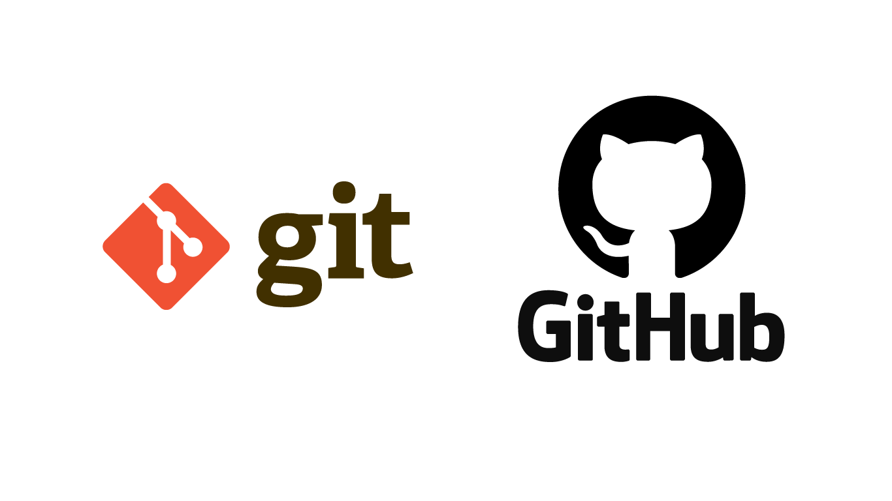

# :material-git: Guía de Git y GitHub

Bienvenido a la **Guía de Git y GitHub**, una guía completa sobre el sistema de control de versiones más utilizado en el mundo del desarrollo de software.

{ width="300" }

## :rocket: ¿Qué encontrarás aquí?

Este manual está diseñado para ayudarte a dominar Git desde lo más básico hasta funciones avanzadas para trabajar en equipo.

!!! tip "Recomendación"
    Si eres nuevo en Git, te recomendamos comenzar por la sección [Introducción a Git](guia/introduccion.md) y avanzar progresivamente.

!!! note "Nota importante"
    Este manual asume que tienes conocimientos básicos de la línea de comandos.

## :material-book-open-page-variant: Contenido del manual

| Sección | Descripción | Nivel |
|---------|-------------|-------|
| [Introducción](guia/introduccion.md) | Conceptos básicos sobre control de versiones | Principiante |
| [Comandos esenciales](guia/comandos.md) | Comandos más usados en Git | Principiante |
| [Flujo de trabajo](guia/flujo.md) | Cómo trabajar con Git en proyectos reales | Intermedio |
| [Ramas y merges](avanzado/ramas.md) | Trabajo con branches y fusión de código | Intermedio |
| [Colaboración](avanzado/colaboracion.md) | Pull requests, forks y trabajo en equipo | Avanzado |
| [Acerca de](about.md) | Información sobre este manual | Informativo |

## :material-lightbulb: ¿Por qué usar Git?

Git ofrece numerosas ventajas para los desarrolladores:

- :material-check: **Control de versiones**: Rastrea todos los cambios en tu código.
- :material-check: **Colaboración**: Trabaja en equipo sin sobrescribir el trabajo de otros.
- :material-check: **Branches**: Crea ramas para nuevas funcionalidades sin afectar el código principal.
- :material-check: **Historial completo**: Recupera versiones anteriores en cualquier momento.
- :material-check: **Distribuido**: Cada copia del repositorio contiene todo el historial.

## :material-code-tags: Ejemplo rápido

Aquí tienes un ejemplo básico de cómo inicializar un repositorio en distintos sistemas operativos:

=== "Linux/macOS"

    ```bash
    # Inicializa un repositorio Git
    git init

    # Verifica el estado
    git status
    ```

=== "Windows (PowerShell)"

    ```powershell
    # Inicializa un repositorio Git
    git init

    # Verifica el estado
    git status
    ```

=== "Git Bash"

    ```bash
    # Inicializa un repositorio Git
    git init

    # Verifica el estado
    git status
    ```

## :material-school: Recursos adicionales

- [Documentación oficial de Git](https://git-scm.com/doc)
- [GitHub Docs](https://docs.github.com/)
- [Pro Git Book (gratuito)](https://git-scm.com/book/es/v2)

---

!!! warning "Importante"
    Antes de continuar, asegúrate de tener Git instalado en tu sistema. Puedes descargarlo desde [git-scm.com](https://git-scm.com/downloads).
